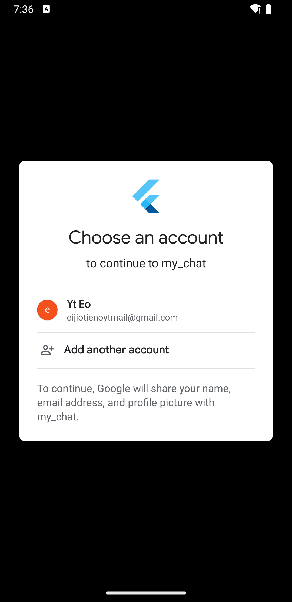
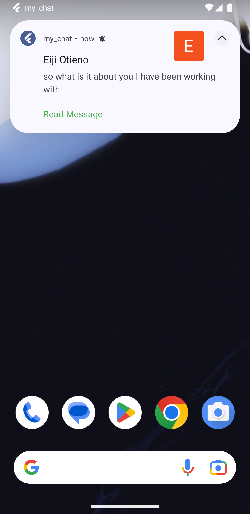
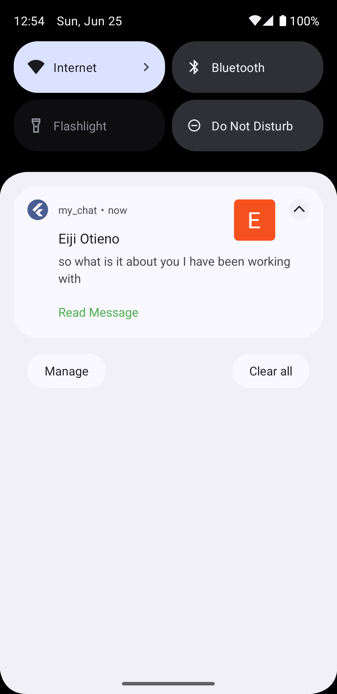
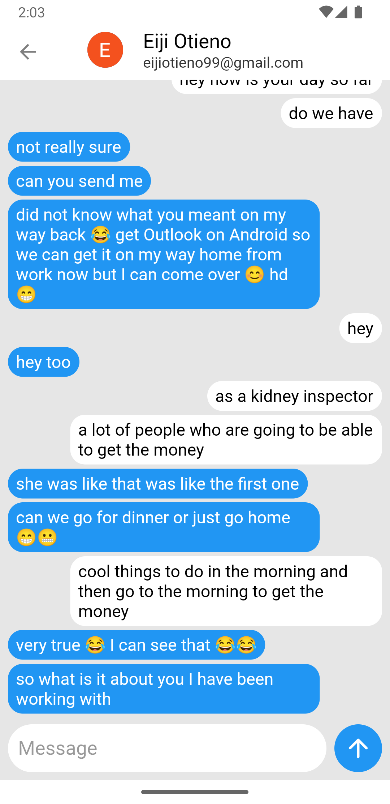

# Instant Messaging App

This repository contains the source code of an instant messaging app built using
the Flutter framework and powered by Firebase.

### Features

- User Authentication: Users can create an account or log in securely using
  Firebase's google sign-in method.
- Real-time Messaging: It enables users to send and receive messages instantly.
- Push Notification: It delivers push notifications to users for timely alerts.
- Offline Support: Users can access their messages hinstory even when offline.

---

## Authentication
- **Firebase's Google Sign-in Method**

---

## Push Notification

- **Awesome Notification Package** is used to show push
  notifications for incoming messages when the app is in the background or
  terminated and also navigate to a specifc chat when Read Message is tapped.

---

## Instant Messaging

---